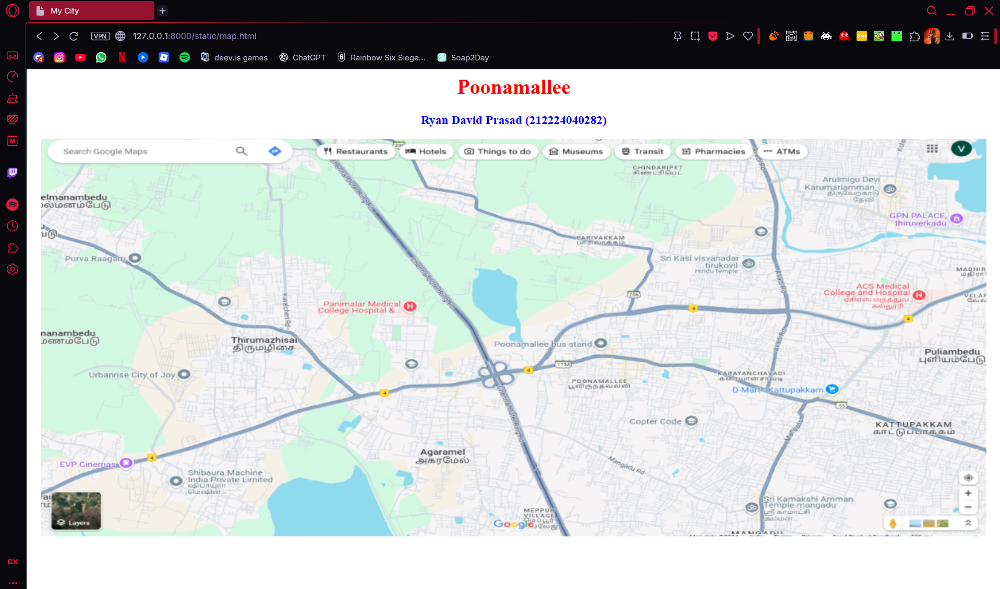
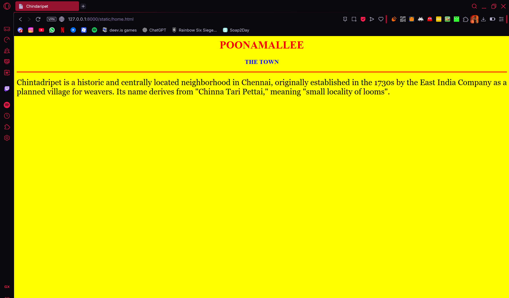
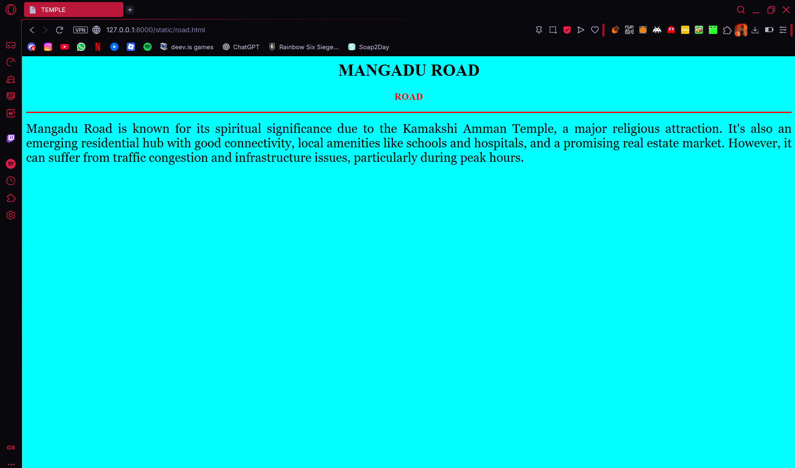
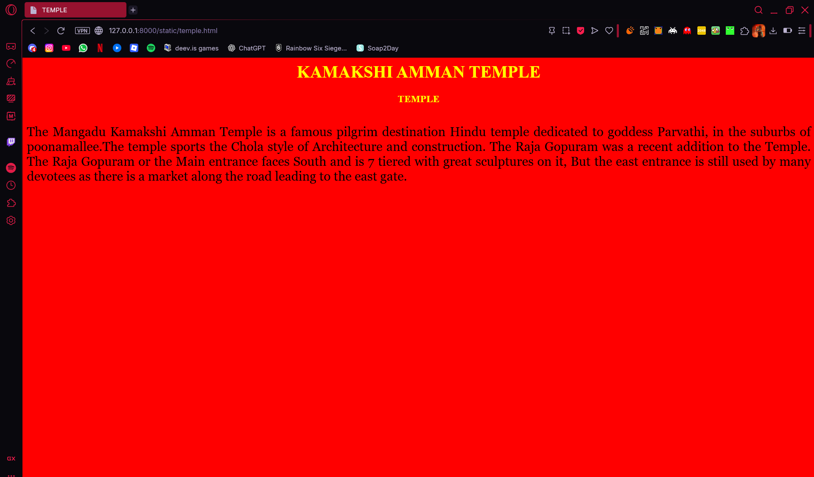
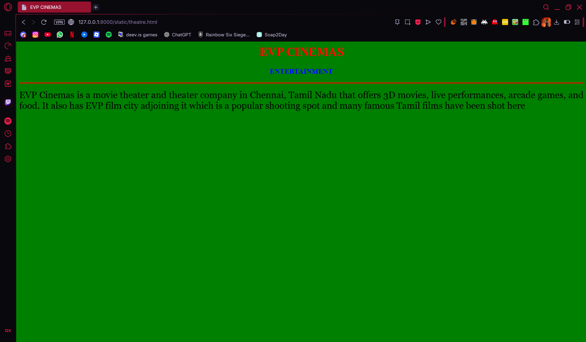
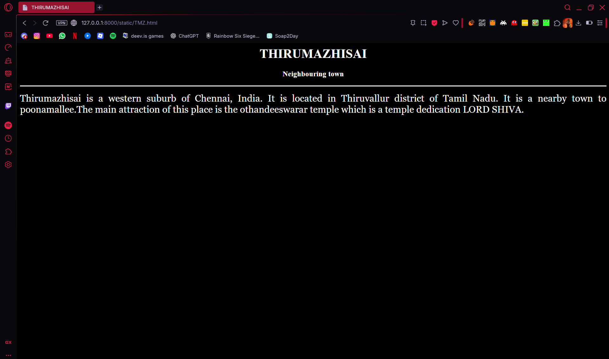

# Ex04 Places Around Me
## Date: 

## AIM
To develop a website to display details about the places around my house.

## DESIGN STEPS

### STEP 1
Create a Django admin interface.

### STEP 2
Download your city map from Google.

### STEP 3
Using ```<map>``` tag name the map.

### STEP 4
Create clickable regions in the image using ```<area>``` tag.

### STEP 5
Write HTML programs for all the regions identified.

### STEP 6
Execute the programs and publish them.

## CODE

```python
Map.html
<html>
<head>
<title>My City</title>
</head>
<body>
<h1 align="center">
<font color="red"><b>Poonamallee</b></font>
</h1>
<h3 align="center">
<font color="blue"><b>Ryan David Prasad (212224040282)</b></font>
</h3>
<center>

<map name="MyCity">
<area shape="circle" coords="900,46,50" href="home.html" title="Chindaripet">
<area shape="circle" coords="910,461,50" href="road.html" title="Mangadu Road">
<area shape="circle" coords="95,450,50" href="theatre.html" title="EVP cinemas">
<area shape="circle" coords="290,290,50" href="TMZ.html" title="Thirumazhisai">
<area shape="circle" coords="1200,550,44" href="temple.html" title="Kamakshi Temple">
</map>
</center>
</body>
</html>
```
```python
home.html
<html>
<head>
<title>Chindaripet</title>
</head>
<body bgcolor="yellow">
<h1 align="center">
<font color="red"><b>POONAMALLEE</b></font>
</h1>
<h3 align="center">
<font color="blue"><b>THE TOWN</b></font>
</h3>
<hr size="3" color="red">
<p align="justify">
<font face="Georgia" size="5">
Chintadripet is a historic and centrally located neighborhood in Chennai, originally established in the 1730s by the East India Company as a planned village for weavers. Its name derives from "Chinna Tari Pettai," meaning "small locality of looms". 
</p>
</body>
</html>

```
```python
road.html
<html>
<head>
<title>Road</title>
</head>
<body bgcolor="cyan">
<h1 align="center">
<font color="BLACK"><b>MANGADU ROAD</b></font>
</h1>
<h3 align="center">
<font color="red"><b>ROAD</b></font>
</h3>
<hr size="3" color="red">
<p align="justify">
<font face="Georgia" size="5">
Mangadu Road is known for its spiritual significance due to the Kamakshi Amman Temple, a major religious attraction. It's also an emerging residential hub with good connectivity, local amenities like schools and hospitals, and a promising real estate market. However, it can suffer from traffic congestion and infrastructure issues, particularly during peak hours. 
</p>
</body>
</html>

```
```python
temple.html
<html>
<head>
<title>TEMPLE</title>
</head>
<body bgcolor="red">
<h1 align="center">
<font color="yellow"><b>KAMAKSHI AMMAN TEMPLE</b></font>
</h1>
<h3 align="center">
<font color="yellow"><b>TEMPLE</b></font>
</h3>
<hr size="3" color="red">
<p align="justify">
<font face="Georgia" size="5">
The Mangadu Kamakshi Amman Temple is a famous pilgrim destination Hindu temple dedicated to goddess Parvathi, in the suburbs of poonamallee.The temple sports the Chola style of Architecture and construction. The Raja Gopuram was a recent addition to the Temple. The Raja Gopuram or the Main entrance faces South and is 7 tiered with great sculptures on it, But the east entrance is still used by many devotees as there is a market along the road leading to the east gate.
</p>
</body>
</html>
```
```python
theatre.html
<html>
<head>
<title>EVP CINEMAS</title>
</head>
<body bgcolor="green">
<h1 align="center">
<font color="red"><b>EVP CINEMAS</b></font>
</h1>
<h3 align="center">
<font color="blue"><b>ENTERTAINMENT</b></font>
</h3>
<hr size="3" color="red">
<p align="justify">
<font face="Georgia" size="5">
EVP Cinemas is a movie theater and theater company in Chennai, Tamil Nadu that offers 3D movies, live performances, arcade games, and food. It also has EVP film city adjoining it which is a popular shooting spot and many famous Tamil films have been shot here
</p>
</body>
</html>
```
```python
TMZ.html
<html>
<head>
<title>THIRUMAZHISAI</title>
</head>
<body bgcolor="black">
<h1 align="center">
<font color="white"><b>THIRUMAZHISAI</b></font>
</h1>
<h3 align="center">
<font color="white"><b>Neighbouring town</b></font>
</h3>
<hr size="3" color="white">
<p align="justify">
<font face="Georgia" size="5" color="white">
Thirumazhisai is a western suburb of Chennai, India. It is located in Thiruvallur district of Tamil Nadu. It is a nearby town to poonamallee.The main attraction of this place is the othandeeswarar temple which is a temple dedication LORD SHIVA.
</p>
</body>
</html>
```

## OUTPUT












## RESULT
The program for implementing image maps using HTML is executed successfully.
